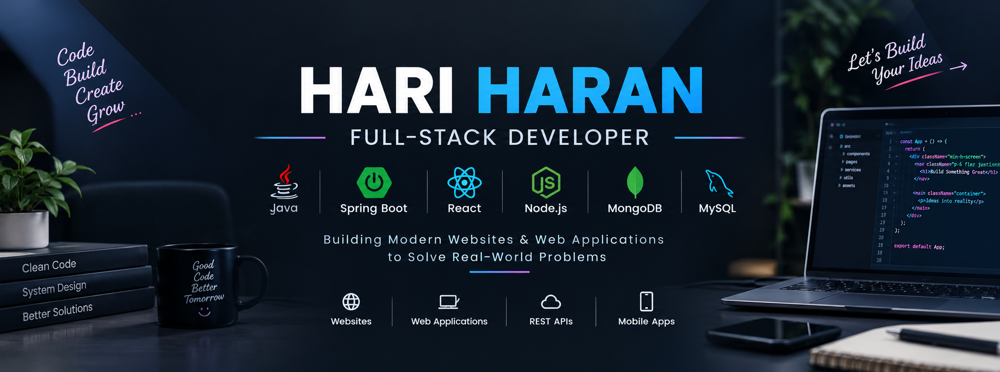

<h1 align="center">Hi 👋, I'm Hari Haran</h1>

<h3 align="center">
Full-Stack Developer | Java & Spring Boot | React | Node.js
</h3>

<p align="center">
  <a href="https://github.com/haranhd">
    
  </a>
</p>

<p align="center">
  <b>I build modern websites, web applications, REST APIs and practical digital solutions for businesses and startups.</b>
</p>

---

## 👨‍💻 About Me

Hi, I'm **Hari Haran**, a Full-Stack Developer and Freelance Developer passionate about building practical, scalable and user-friendly digital solutions.

I work mainly with **Java, Spring Boot, React, Node.js, Express.js, MySQL and MongoDB**.

I enjoy taking an idea from concept to a working application — from designing the frontend and developing APIs to connecting databases and deploying the final product.

### 🚀 What I Do

- 🌐 Business Websites & Landing Pages
- 💻 Full-Stack Web Applications
- ⚙️ REST API Development
- 🔐 Authentication & Authorization
- 🗄️ MySQL & MongoDB Database Integration
- 💳 Payment Gateway Integration
- 📊 Admin Dashboards & Management Systems
- 📱 Responsive React Applications
- 🔗 Third-Party API Integrations
- 🚀 Deployment & Production Setup

---

## 🛠️ Tech Stack

### 💻 Languages

<p align="left">
  
  
  
  
</p>

### 🌐 Frontend

<p align="left">
  
  
  
  
</p>

### ⚙️ Backend

<p align="left">
  
  
  
  
</p>

### 🗄️ Databases

<p align="left">
  
  
</p>

### 🔧 Tools & Technologies

<p align="left">
  
  
  
  
</p>

---

## 🚀 Featured Projects

### 🌾 AI Farming Platform

An AI-powered farming platform designed to provide farmers with useful agricultural information and services.

**Tech Stack:**
`React` `Flask` `MongoDB` `AI/ML` `Weather API`

**Key Features:**
- 🤖 AI-powered farming chatbot
- 🌦️ Weather information
- 🛒 Agricultural marketplace
- 🔐 User authentication
- 🌱 Farming-related assistance
- 🎙️ Voice interaction support

🔗 **Repository:** [AI Farming](https://github.com/haranHD/S8_AI-Farming)

---

### ⚖️ eCourt – Case Search & Management System

A web application designed to search and manage Indian court case information using CNR-based search.

**Tech Stack:**
`.NET 8` `React` `PostgreSQL` `Entity Framework Core` `Playwright`

**Key Features:**
- 🔎 CNR case search
- 📋 Saved cases
- 👤 User dashboard
- 🗄️ PostgreSQL database
- 🌐 Automated web interaction
- 📊 Case management interface

🔗 **Repository:** [eCourt](https://github.com/haranHD/eCourt)

---

### 📚 Library Management System

A Java-based application for managing books, users and library operations.

**Tech Stack:**
`Java` `MySQL`

**Key Features:**
- 📖 Book management
- 👤 User management
- 🔄 Issue & return management
- 🗄️ MySQL database integration

---

### 💬 Real-Time Chat Application

A real-time communication application built using WebSocket technology.

**Tech Stack:**
`Java` `Spring Boot` `WebSocket`

**Key Features:**
- 💬 Real-time messaging
- 🔌 WebSocket communication
- 👥 Multiple user support
- ⚡ Real-time message delivery

---

## 💼 Freelance Development

I also work as a **Freelance Web & Application Developer**, helping businesses and individuals build their digital presence and custom applications.

### I can help with:

🌐 **Business Websites**

Modern, responsive websites for businesses, startups and personal brands.

💻 **Web Applications**

Custom applications designed around specific business requirements.

⚙️ **Backend Systems**

REST APIs, authentication, database systems and business logic.

📊 **Admin Dashboards**

Management dashboards for handling business data and operations.

🔗 **API Integrations**

Third-party API, payment and external service integrations.

📱 **Responsive Applications**

Applications designed to work smoothly across desktop, tablet and mobile devices.

---

## 📈 Currently Learning

- ☕ Advanced Java
- 🌱 Spring Boot
- ⚛️ Advanced React
- 🏗️ System Design
- 🔐 Backend Security
- ☁️ Cloud & Deployment
- 🚀 Scalable Application Architecture
- 🔎 SEO & Web Performance

---

## 🎯 My Development Philosophy

> **Build practical solutions, write clean code, and continuously improve.**

I believe a good application is not just about writing code.

It should be:

- ⚡ Fast
- 📱 Responsive
- 🔐 Secure
- 🎨 User-friendly
- 🧩 Maintainable
- 📈 Scalable

---

## 🧩 Development Workflow

```text
Idea
  ↓
Requirement Analysis
  ↓
UI / UX Planning
  ↓
Frontend Development
  ↓
Backend & API Development
  ↓
Database Integration
  ↓
Testing
  ↓
Deployment
  ↓
Maintenance & Improvements
